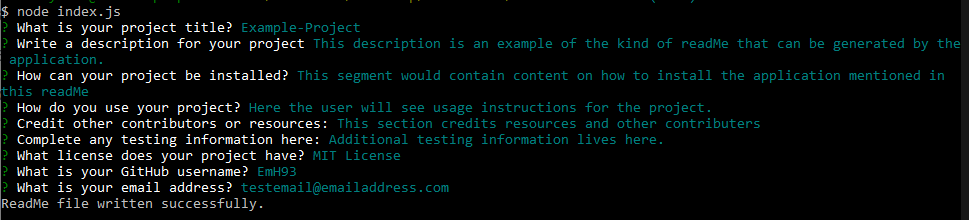
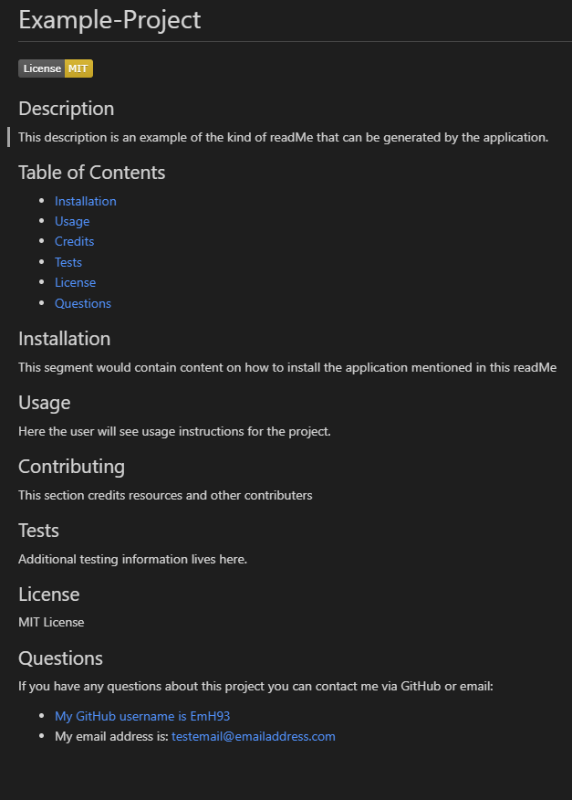

# <ReadMe-Generator>

## Description

This project was my first opportunity to work and build with Node.js. I initially found the concept of using command line to generate a file quite intimidating, but upon learning how much javascript goes into node, I felt somewhat more confident. Working with NPM's was confusing at first but I hope by utilising inquirer npm I am making steps towards better understanding how npm packages work.

The aim of this project was to create a node file that would allow the user to answer prompts in the command line, and subsequently generate a new ReadMe file with the information they have put in. The ReadMe needed to contain a title, description, table of contents (that on click takes the user to that section), installation, usage, contributing, tests, license and a questions/contact section that inputs the users gitHub profile and email address.

## Installation

Clone the files from the repo. Users will need Node.js installed to use this project. Users will also need to run "npm init" and "npm install --save inquirer@^8.0.0" in the folder before they can run the file. Once installed, the application can be started by typing "node index.js" in the command line.

Alternatively, you can watch a demo of this project here: [ReadMe-Generator Walkthrough](https://watch.screencastify.com/v/5h6PXzYUG2SV91GbPaU9)

## Usage

This application is run via Node.js in the command line. Once the correct NPM packages are added to the users folders, the application can be run from within the folder in Bash by typing "Node index.js".

The user will then be prompted to answer a variety of questions that will in turn fill out the generated ReadMe Markdown file. The questions and some example answers are shown below:

  

This then creates the resulting readMe in the folder "Test-ReadMe-Files" As seen in the screenshot shown below:  

## Credits

Starter file provided by edX front end development bootcamp.  
[inquirer NPM](https://www.npmjs.com/package/inquirer?activeTab=readme) 

## License

MIT License